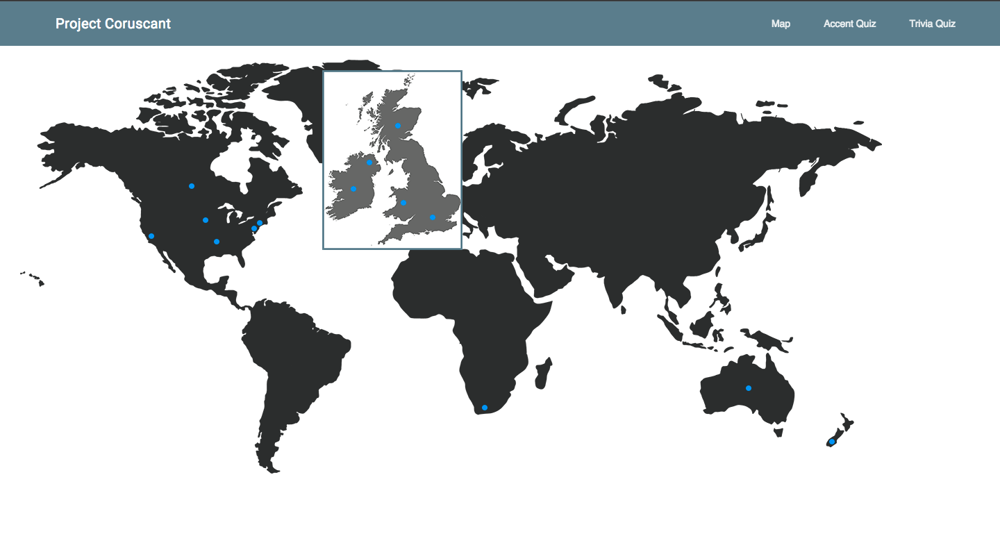

# Project_Coruscant
## Our Goal
Project Coruscant aims to introduce newcomers to the many different english accents around the world. Along with the accents we deemed the most interesting to add, we've added facts about each region or country available on the platform. The website is a prototype. It can't be found on the Internet. You can freely use our code though. To access the website, simply download the repository and double click on index.html, it'll launch on your favorite browser.
## Getting Started
Here, you'll learn how to use our website. Don't worry, we made it pretty self-explanatory !
First of, when logging in you'll see a world map.  
  
You can interact with it to either :
  * Access accents and information about regions by clicking the blue buttons.
  * Access the different quizzes the Project has to offer by clicking the affiliated buttons.
  * Get back to the world map by clicking the map button.  

After clicking one of the blue buttons you will be able to see all the information about the
region you chose.  
  
Here's all the things you can access :
  * First of all, the accent. To make it easier for you to compare all of them, we retrieved recordings of the same sentence for every accents. Just click the audio player on the far left to listen to it. You can also adjust the volume to your convenience and pause the recording when you feel like it.
  * On the left along the player, you will find the name and flag of the region and also its nickname and motto. A motto is a phrase meant to formally summarize the general motivation or intention of the region. It's basically the region's slogan !
  * In the middle, you will find three to four fun facts about the region.
  * On the right, you will find two celebrities that come from the region because we feel that sometimes it's easier to put a familiar face on a place.
  * We've also added videos that showcase the celebrity's accent. You can access that video by clicking on the picture.  

When you're all done learning about these accents, you can test your skills with the Accents Quizzes.  
  
Their level are ranging from easy to difficult so that you can progress with ease.
You can also try the trivia quiz which is a little more general.  
  
 
You're all set ! We hope you try out the website for yourself !

## Sources

Accents recordings :
www.accent.gmu.edu/about.php

Base code for the quizzes :
www.hungrypiranha.org/make-a-website/html-quiz

Material designed components used :
www.getmdl.io/components/

Full CSS animations :
www.github.com/daneden/animate.css

Celebrities photos and world map courtesy of Google Images
